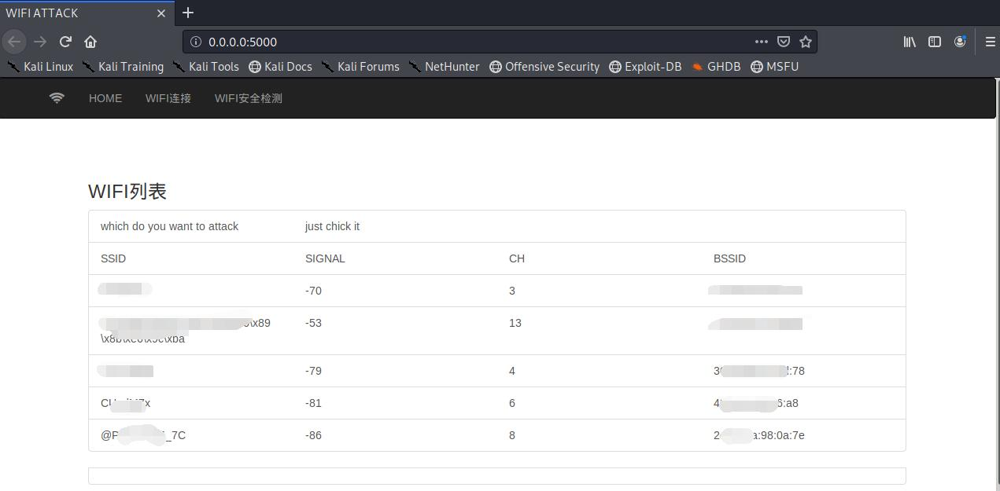
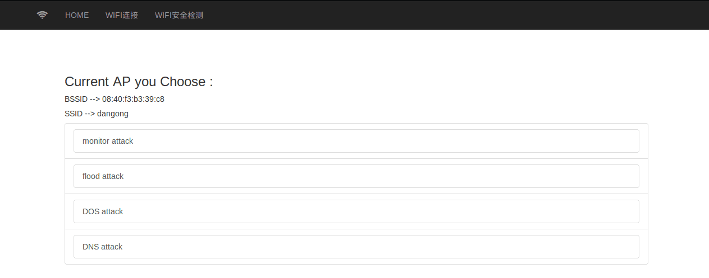
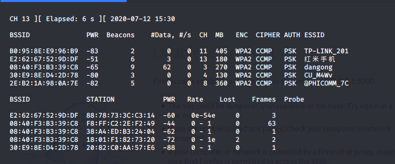
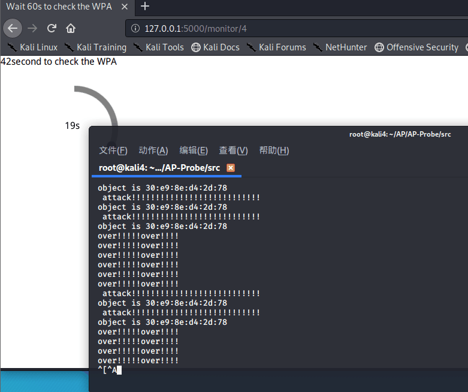
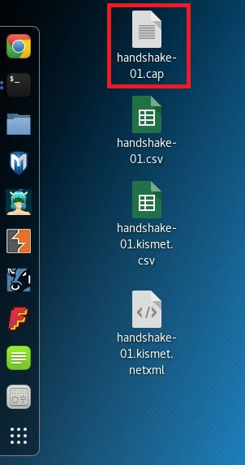
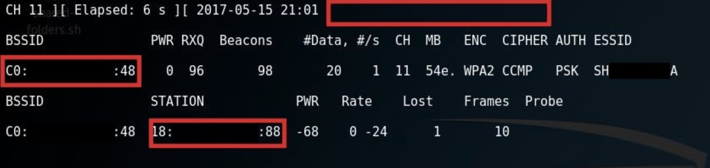
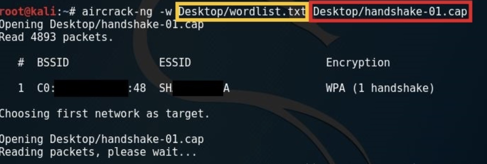
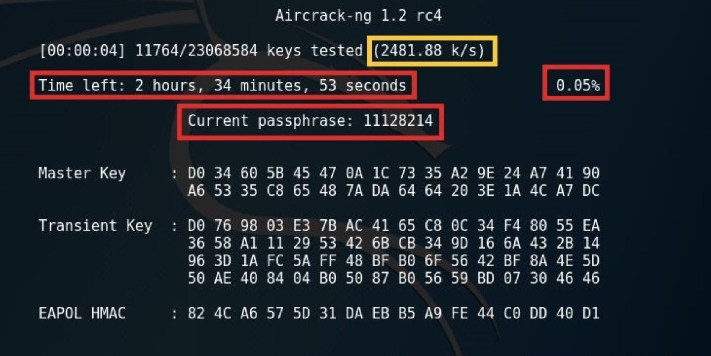
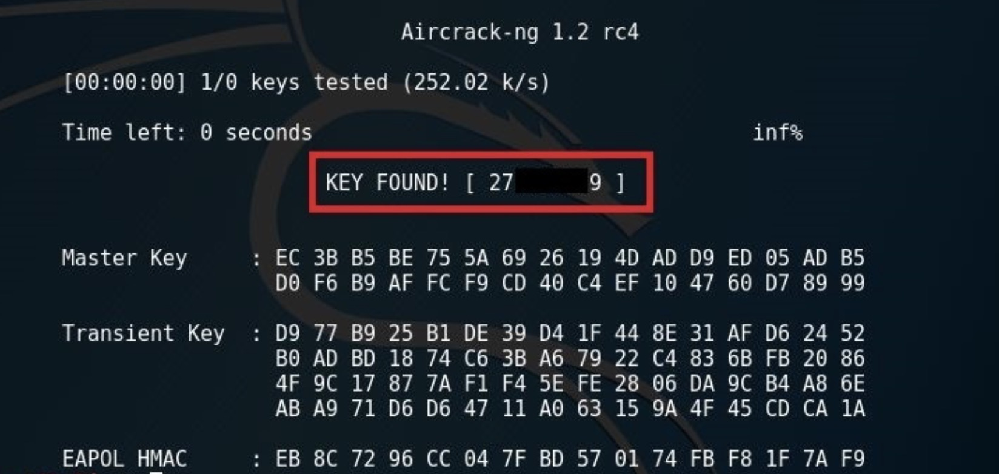

# AP-Probe

## 项目简介

#### 功能

1 对周边AP进行捕获感知
2 deautenticate数据包发送使得设备与AP断开连接
2 握手包获取
3 密码破解

#### 目标用户

对无线安全没有基础的用户,或希望简化操作流程,在图形化界面中快速感知捕获的老练用户
无线AP探测破译软件，无线安全爱好者

#### 设备需求

需要设备额外外接网卡

(或拥有双网卡

## 快速开始

#### 安装依赖部署

```shell
source setenv.sh
```

#### 启动项目

```shell
python3 main.py
```
随后访问本地路径 127.0.0.1:5000 即可进入到感知模式

本软件⽤于审核家庭⽆线路由器安全性,破解别⼈的⽆线路由器密码是违法的，放弃WEP，真爱WPA2，
禁⽤WPS

请勿进行违法操作

## 接口API

不对外提供API

操作全流程均在浏览器图形化界面进行即可

无需进行API调用操作,故未预留外部接口API

## 性能指标

内部使用threading多线程进行多操作并发,通过Pywifi感知捕获无线AP理论数量无上限,但是在主页未提供AP检索功能,AP按照信号强度降序排列,感知弱信号AP性能欠佳,需要手动翻页才能完成

基于

## 运行测试环境

#### 软件环境

仅使用setenv.sh即可完成环境一键部署

Kali-Linux中配置了aircrack-ng,无需再次安装

且系统自带python3环境,可以仅安装python3相关依赖并外接网卡即可成功运行系统

#### 硬件环境

8G硬盘空间,4G内存,CPU 配置1-1即可

配置可以根据自身情况进行适当压缩

## 架构设计

采用经典后端架构设计,代码主逻辑放在main.py文件中,通过jinja语法将前后端联通；通过subprocess管道化通信调用aircrack-ng

## 运行截图



项目首页，可以在wifi列表中进行选取。

在系统中任意页面点击左上角即可回到主界面



功能选择界面，仅提供了前两个功能

后两个功能本阶段暂时不开放使用



后台监听界面

上半部分是无线AP

下半部分是对应链接设备


项目启动页面

可以访问本地5000端口进行浏览器操作



flood洪水攻击界面

deautenticate数据包使得设备与AP之间断开连接

## 技术原理

#### flood泛洪攻击

利用了aircrack的deautenticate冲突模式攻击

-0  deautenticate冲突模式
使已经连接的合法客户端端强制断开与路由器的连接，使其重新连接。在重新连接过程中获得验证数据包，从而产生有效的arp数据。
如果一个客户端连在路由器上，但是没有人上网来产生有效数据，此时即使用-3也无法产生有效的arp数据，所以就需要用-0攻击模式来配合-3攻击来会被激活
aireplay-ng -0 10 -a ap_mac -c 合法客户端mac wifi0
参数说明：10表示发送次数（设置为0表示循环攻击，客户端无法正常上网）
-a设置ap的mac地址，-c设置已连接的合法客户端的mac地址(如果要-c则所有与ap连接的客户端全部断线）

#### AP感知

利用了pywifi模块与aircrack-ng的监听功能实现无线AP感知

###### threading:

python多线程模块,提供并发处理

程序运行时默认在主线程上

进程是由若干线程组成的，一个进程至少有一个线程。

由于线程是操作系统直接支持的执行单元，因此，高级语言通常都内置多线程的支持，Python也不例外，并且，Python的线程是真正的Posix Thread，而不是模拟出来的线程。

Python的标准库提供了两个模块：_thread和threading，_thread是低级模块，threading是高级模块，对_thread进行了封装。绝大多数情况下，我们只需要使用threading这个高级模块。

Lock
多线程和多进程最大的不同在于，多进程中，同一个变量，各自有一份拷贝存在于每个进程中，互不影响，而多线程中，所有变量都由所有线程共享，所以，任何一个变量都可以被任何一个线程修改，因此，线程之间共享数据最大的危险在于多个线程同时改一个变量，把内容给改乱了。

###### pywifi:
参考链接 https://pypi.org/project/pywifi/

linux中需要支持wpa_supplicant才能操作wifi设备,pywifi通过socket通信进行具体操作

###### aircrack-ng:
先将网卡设置为aircrack-ng认证的监听模式
```shell
airmon-ng wlan0
```
再启用监听模式
```shell
airodump-ng wlan0
```
注：airodump-ng <你的monitor名称>

BSSID是AP端的MAC地址
PWR是信号强度，数字越小越好
#Data是对应的路由器的在线数据吞吐量，数字越大，数据上传量越大。
CH是对应路由器的所在频道
ESSID是对应路由器的名称

捕获握手包
– 使用airodump-ng监听指定目标频道。
sudo airodump-ng -c 6 -w Desktop/handshake --bssid C0:00:00:00:00:48 wlan0mon

在你的抓取握手包的存放目录会生成4个文件
注：握手包文件的拓展名为 .cap 如红色方框所示



然后，你的网卡会开始监听你目标端的频道,等待握手数据包在设备与AP连接时进行监听并捕获,如下图右上角的位置在捕获后将会有明确提示



**注**：请注意右上方（日期和时间右边的区域），如红色方框所示。以及在STATION栏中的Client MAC地址，选取一个客户端MAC地址并记录。


**– 关闭监听模式。**

```
sudo airmon-ng stop wlan0mon
```

**– 使用字典进行暴力破解。**

`sudo aircrack-ng -w Desktop/wordlist.txt Desktop/handshake-01.cap` 
**注**：`aircrack-ng -w <字典路径> <握手包路径>



破解速度取决你CPU的核心数和频率

我在虚拟机速度为 2481.88 k/s（黄色区域）。图中红色区域分别为：跑完字典的剩余时间；完成率；当前尝试的密码



当密码破解成功时，会在图红色区域位置显示”KEY FOUND!”字样，中括号为AP端的密码



## 制作简单字典

在Linux中可以使用crunch来制作一个简单的字典，下面是自作方法。

安装crunch sudo apt-get install crunch

使用语法 crunch <min> max<max> <characterset> -t <pattern> -o <output filename>
例如，如果您知道目标的生日是0728（7月28日），并且认为他们以自己的密码包含他们生日，则可以生成一个以0728为结尾的密码列表，方法为@@@@@@@0728。 该字最多可生成11个字符（7个变量和4个固定）密码，然后全部都以0728结尾

## 注意
wpa/wpa2的密码破解较为随机,破解的成败完全靠一个适合的字典，不管怎么说，一个强大字典是肯定可以提高破解的成功几率。

本软件用于审核家庭无线路由器安全性,破解别人的无线路由器密码是违法的，放弃WEP，真爱WPA2，禁用WPS

推荐外接网卡

