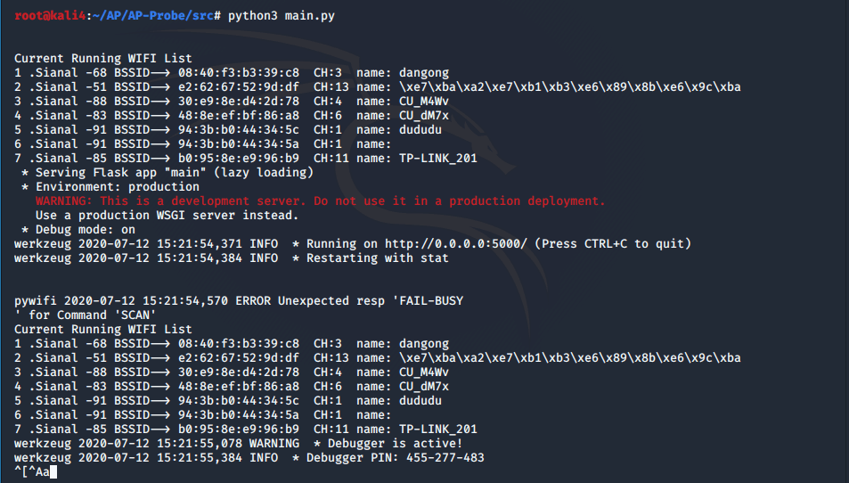

# AP-Probe

## 项目简介

#### 定义

对周边AP进行捕获感知,握手包获取,密码破解

#### 目标对象用户

对无线安全没有基础的用户,或希望简化操作流程,在图形化界面中快速感知捕获的老练用户
无线AP探测破译软件

#### 设备需求

需要设备额外外接网卡(或拥有双网卡

## 快速开始

#### 安装依赖部署

```shell
source setenv.sh
```

#### 启动项目
```shell
python3 -m main.py
```
随后访问本地路径 127.0.0.1:5000 即可进入到感知后台

## 接口API

暂无

操作全流程均在浏览器图形化界面进行即可,无需在后端进行API调用操作,所以本项目中未预留外部接口API

## 性能指标

内部使用threading多线程进行多操作并发,通过Pywifi感知捕获无线AP理论数量无上限,但是在主页未提供AP检索功能,AP按照信号强度降序排列,感知弱信号AP性能欠佳,需要手动翻页才能完成

## 运行测试环境

Kali-Linux中配置了aircrack-ng,无需再次安装,且系统自带python3环境,可以仅安装python3相关依赖并外接网卡即可成功运行系统

#### 硬件环境

8G硬盘空间,4G内存,CPU 配置1-1即可

## 架构设计

因为代码量比较少,所以就都放在main.py文件中,通过jinja语法将前后端联通

## 运行截图


项目首页


功能选择界面，仅提供了前两个功能


后台监听界面



项目启动页面


flood洪水攻击界面